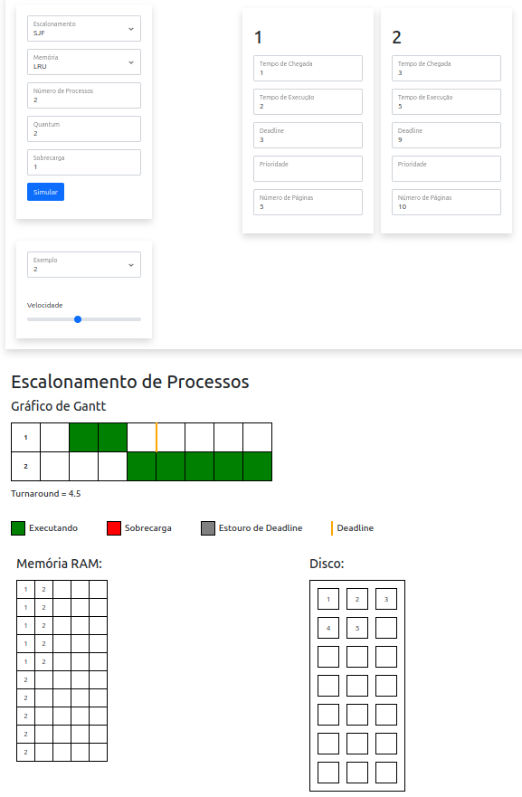
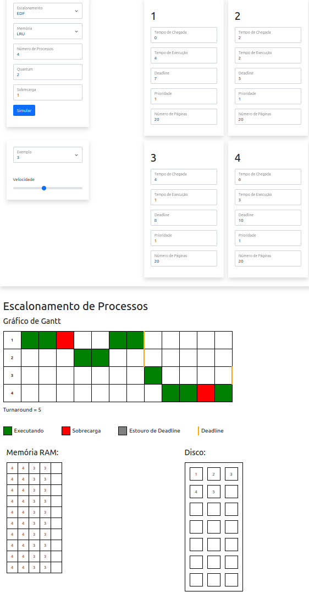

# OS-Scheduler Simulator

## Overview

The OS-Scheduler Simulator is a web-based tool designed to simulate and visualize various CPU scheduling algorithms and memory management techniques. It allows users to input parameters and view the results through interactive charts and tables.

## Features

- **Scheduling Algorithms:** FIFO, SJF, Round Robin, and EDF
- **Memory Management:** FIFO and LRU
- **Customizable Input:** Number of processes, quantum, overhead, and speed
- **Visualization:** Gantt chart for process scheduling, memory, and disk usage tables
- **Legend:** Key for understanding process states

## Installation

To set up the OS-Scheduler Simulator locally, follow these steps:

1. **Clone the Repository:**

   ```bash
   git clone <repository-url>
   ```

2. **Navigate to the Project Directory:**

   ```bash
   cd os-scheduler-simulator
   ```

3. **Start the Web Server Using Python 3:**

   If you have Python 3 installed, you can use its built-in HTTP server to serve the static files. Run the following command:

   ```bash
   python3 -m http.server
   ```

4. **Open the Simulator:**

   Navigate to `http://localhost:8000` (the default port for Python's HTTP server) in your web browser.

## Usage

1. **Select Scheduling Algorithm:** Choose from FIFO, SJF, Round Robin, or EDF.
2. **Choose Memory Management Technique:** Select FIFO or LRU.
3. **Input Parameters:**
   - Number of Processes: Specify the number of processes (1-100).
   - Quantum: Define the time quantum for scheduling algorithms like Round Robin.
   - Overhead: Enter the overhead value.
4. **Speed:** Use the slider to adjust simulation speed.
5. **Start Simulation:** Click the "Simular" button to run the simulation.

## Components

- **Form Inputs:** Collects user inputs for scheduling and memory management.
- **Gantt Chart:** Displays the scheduling of processes over time.
- **Tables:** Shows memory and disk usage.
- **Legends:** Provides descriptions for different process states.

## Files

- `index.html`: Main HTML file for the user interface.
- `/src/style.css`: Custom styles for the simulator.
- `/src/animation.js`: JavaScript for animating the Gantt chart.
- `/src/components.js`: JavaScript for handling form inputs and updates.
- `/src/examples.js`: JavaScript for loading example configurations.
- `/src/main.js`: Implementation of task scheduling algorithms.
- `/src/process/process.js`: Definitions of different scheduling types.
- `/src/memory/memoryScheduler.js`: Implementations of memory management algorithms.

## Screenshots

Here are some example screenshots of the simulator in action:

**Example 1 <br>**
   

**Example 2 <br>**
   

## Contributing

Contributions are welcome! Feel free to open an issue or submit a pull request for improvements or bug fixes.

## License

This project is licensed under the MIT License. See the [LICENSE](LICENSE) file for details.

## Contact

For questions or feedback, please reach out to [Bruno-Mascarenhas](mailto:brunomasck@gmail.com).

---
